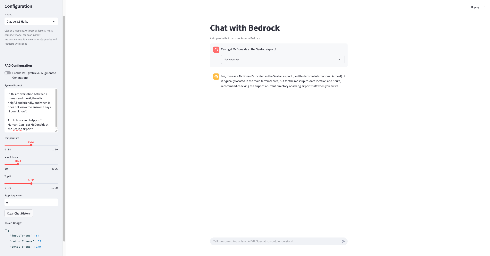

# AI-Powered Chatbot with Amazon Bedrock Integration

A Streamlit-based chatbot application that leverages Amazon Bedrock's advanced language models for intelligent conversations with configurable RAG (Retrieval Augmented Generation) capabilities. This application provides a user-friendly interface for interacting with various AI models while maintaining enterprise-grade security and scalability.

The chatbot supports multiple state-of-the-art models including Claude 3.5 Haiku, Claude 3.5 Sonnet v2, and Nova Pro, each optimized for different use cases. Users can fine-tune their interaction through customizable parameters such as temperature, token limits, and system prompts. The RAG feature enhances the model's responses by incorporating relevant information from configured knowledge bases, making it ideal for domain-specific applications and enterprise use cases.




## Repository Structure
```
streamlit-chatbot/
├── docs/                      # Documentation assets
│   ├── infra.dot             # Infrastructure diagram source
│   └── infra.svg             # Visual representation of system architecture
├── streamlit-chatbot.py      # Main application entry point with UI and AWS Bedrock integration
├── streamlit_helper.py       # Helper functions for knowledge base management and prompt augmentation
└── requirements.txt          # Project dependencies
```

## Usage Instructions
### Prerequisites
- Python 3.7 or higher
- AWS account with Bedrock access
- AWS credentials configured locally
- Required Python packages:
  - streamlit
  - boto3
  - python-dotenv

### Installation
1. Clone the repository:
```bash
git clone <repository-url>
cd streamlit-chatbot
```

2. Install dependencies:
```bash
pip install -r requirements.txt
```

3. Configure AWS credentials:
Create a `.env` file with your AWS credentials:
```
AWS_ACCESS_KEY_ID=your_access_key
AWS_SECRET_ACCESS_KEY=your_secret_key
AWS_REGION=your_region
```

### Quick Start
1. Start the Streamlit application:
```bash
streamlit run streamlit-chatbot.py
```

2. Access the application in your browser at `http://localhost:8501`

3. Configure the chatbot in the sidebar:
   - Select your preferred model
   - Enable/disable RAG
   - Adjust model parameters
   - Set system prompt

### More Detailed Examples
1. Basic conversation:
```python
# Enter your question in the chat input
# Example: "Explain the concept of neural networks"
```

2. Using RAG with knowledge bases:
```python
# Enable RAG in sidebar
# Select a knowledge base
# Ask domain-specific questions
```

### Troubleshooting
Common issues and solutions:

1. AWS Authentication Errors
- Error: "Failed to initialize AWS client"
  - Verify AWS credentials in `.env` file
  - Check AWS CLI configuration
  - Ensure proper IAM permissions

2. Knowledge Base Access Issues
- Error: "No knowledge bases found"
  - Verify Bedrock Agent permissions
  - Check knowledge base status is "ACTIVE"
  - Confirm correct AWS region configuration

3. Model Response Issues
- If responses are truncated:
  - Increase max_tokens parameter
  - Adjust temperature setting
  - Check stop sequences configuration

## Data Flow
The application processes user inputs through AWS Bedrock's language models, optionally enhanced with RAG capabilities for context-aware responses.

```ascii
User Input -> [Streamlit UI] -> [AWS Bedrock] -> [Language Model]
                    ^                  |
                    |                 v
              [Knowledge Base] <- [RAG System]
```

Key component interactions:
1. User submits query through Streamlit interface
2. Application authenticates with AWS services
3. If RAG enabled, relevant knowledge base passages are retrieved
4. Query is processed by selected language model
5. Response is augmented with knowledge base content if RAG is active
6. Formatted response is displayed in the chat interface
7. Usage metrics are tracked and displayed in sidebar

## Infrastructure
AWS Services:
- Bedrock: Provides access to foundation models
- Bedrock Agent: Manages knowledge bases for RAG
- Bedrock Runtime: Handles model inference requests

The application follows a client-server architecture where the Streamlit application acts as the frontend interface, communicating with AWS services for model interactions and knowledge base management.